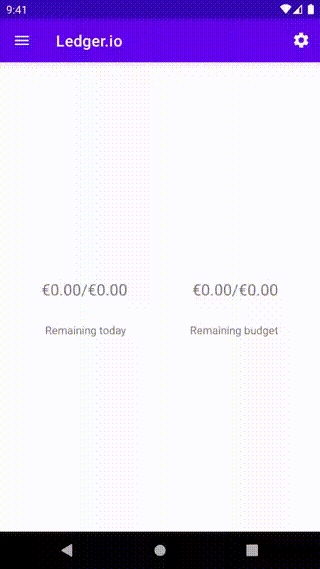

# Ledger.io

Ledger.io is intended to be a simple app which listens to the notifications made by apps such as [Revolut](www.revolut.com) and [Google Pay](www.pay.google.com) when they are used to purchase products. The aim of this app is to
aggregate the output of these apps to track your spending and notify you of how much you spend in a given day
and how much you have left to spend in a given budget period.

## Built With

* [Android Jetpack]([https://developer.android.com/jetpack](https://developer.android.com/jetpack)) - Android Library Suite.

### Todo

- [ ] Calendar selection for interval preference
- [ ] Visual Representation of Budget remaining (simple Progressbar for now)
- [ ] Budget and Spending breakdown
	- [ ] Graph showing spending / time
	- [ ] Types of spending (if possible?)

### In Progress
- [ ] Implement Settings
	- [ ] Currency setting
	- [X] Daily limits
	- [x] Monthly Budgets

### Done ✓

- [x] Create TODO.md
- [x] Implement ViewModel for RemainingMoneyFragment
- [x] Simple layout for RemainingMoneyFragment
- [x] Create Schema for the DB, create DB and DAOs, implement update methods, test they work.
- [x] Build Service that listens to Notifications, update DB when Notification pings
- [x] Fix TextView layout centering issue
- [x] ViewModel update on Notification Ping, update on `onResume()`
- [x] Remove redundant Spend class - this can be computed using historical budget info
- [x] Notify user of how much is left to spend in the day when money has been spent
- [x] Implement AlarmManger to reset budget after given period
- [X] Parse Notification for spend amount

